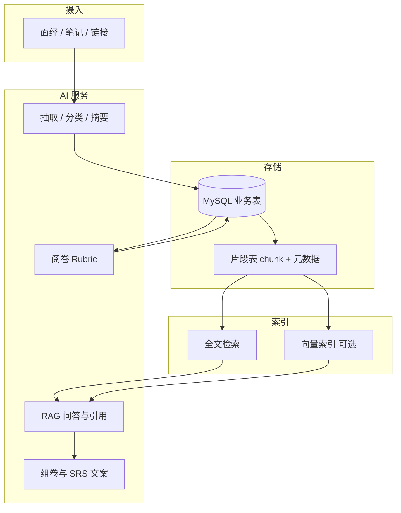

# Interview Collector：AI 能力进化与「第二大脑」愿景

本文档在仓库当前实现（FastAPI + MySQL、练习会话、火山引擎 Ark/豆包结构化调用）的基础上，给出**可落地的全局进化方案**：从「接一句 API」走向**个人知识库 + AI 第二大脑**，并兼顾**学生场景**（尽量不跑本地大模型、控制云端推理与向量成本）。

相关实现与配置请参阅：

- [豆包（Ark）对接说明](./ai-doubao-integration.md)
- [Prompt 设计](./prompt-design.md)
- [API 设计](./api-design.md)

---

## 1. 文档目标与读者

| 目标 | 说明 |
|------|------|
| 产品愿景 | 明确「面试题库工具」如何演进为「个人知识库 + 第二大脑」 |
| 技术路线 | 分阶段列出可实施模块与依赖顺序 |
| 简历叙事 | 标出可写成项目亮点/实习经历的技术点（避免空泛的「调了大模型 API」） |
| 成本约束 | 在不用本地大权重模型的前提下，通过架构与策略压低成本 |

---

## 2. 当前基线（基于仓库现状）

### 2.1 已有能力

- **后端**：FastAPI；健康检查、题目 CRUD、练习会话、提交与摘要等（详见根目录 `README.md` 的 Current Baseline）。
- **数据**：MySQL + Alembic；题目、练习记录、会话、分类/导入相关表等已存在或规划中。
- **AI 服务**（`backend/app/services/ai_service.py`）：
  - 统一走 Ark **Responses** 风格接口，支持重试、超时、多种响应体解析。
  - **结构化 JSON 抽取**（`call_doubao_extract`）：用于导入/抽取等「必须可解析」的路径。
  - **参考答案生成**（`call_doubao_reference_answer`）。
  - **练习打分解析**（`call_doubao_grade`），含 JSON 解析失败时的有限降级。

### 2.2 典型「半成品」特征（改进空间）

- AI 多为**单次调用、单次输出**，与「长期知识积累」尚未形成闭环。
- 缺少面向用户的**可检索个人语料层**（不仅是表里的题目行，而是「块级」内容与引用）。
- 缺少统一的 **AI 任务治理**（版本、成本、缓存、异步、可观测），扩展多场景时容易重复造轮子。

### 2.3 题目去重：当前实现与缺口（痛点）

**现状（代码层）**

- **导入预览** `POST /api/import/preview`：在同一批预览结果里，用 `_normalize_stem`（去空白、转小写）在内存集合 `seen_stems` 中去重，**仅去掉「本次预览里字面高度重合」的 stem**，不访问数据库。
- **单条/批量入库** `POST /api/import/commit-one`、`POST /api/import/commit`：逐条插入，**未与库中已有题目比对**，因此历史上已存在的题会被再次写入。
- **`questions` 表**（`backend/app/models/question.py`）：当前无 `content_hash` / `stem_normalized` 等持久化去重键，无法在数据库层做唯一约束或快速查重。

```218:219:backend/app/api/import_routes.py
def _normalize_stem(stem: str) -> str:
    return "".join(stem.lower().split())
```

```262:266:backend/app/api/import_routes.py
                key = _normalize_stem(stem)
                if key in seen_stems:
                    continue
                seen_stems.add(key)
                merged_questions.append(q)
```

**用户可感知的问题**

- 同一面经多次导入、或表述略异但考点相同的题干 → **重复题库**。
- 仅规范化字符串无法覆盖「语序不同 / 多一个请简述 / 同义改写」的**语义重复**。

**推荐演进（按投入递增）**

| 优先级 | 方案 | 说明 |
|--------|------|------|
| P0 | **入库前 DB 查重** | 对 `normalize(stem)` 建索引或存 `stem_fingerprint`；`commit` / `commit-one` 前 `SELECT` 命中则返回 `duplicate_of_id` 并跳过或合并。成本低、立刻缓解重复入库。 |
| P1 | **模糊 / 语义去重** | SimHash/MinHash 或云端 **embedding** 相似度阈值；预览阶段标注「可能与 #id 重复」供用户确认。 |
| P2 | **合并策略** | 重复题合并公司/岗位/来源，保留更完整 `reference_answer`；需产品与 UI（合并向导）。 |

**与当前迭代顺序的关系**：上述去重仍属正确方向，但在 [feature-roadmap-tasks-and-tech.md](./feature-roadmap-tasks-and-tech.md) 中已整体**后挪**（该文档 **§9**）；优先先做 **§1 减少重复 AI 调用** 与 **§2 RAG**，再回头做库级去重。

**简历表述**：*Near-duplicate detection and idempotent import against existing corpus (lexical + optional semantic fingerprinting).*

---

## 3. 愿景定义：三层架构

将「第二大脑」拆成三层，便于分阶段实现与在简历中表述系统边界。

| 层级 | 名称 | 职责 | 与现有项目的关系 |
|------|------|------|-------------------|
| L1 | **资料层** | 面经原文、笔记、链接摘要、自己的作答历史 | 扩展 `questions`、练习记录；可增加「文档/片段」实体 |
| L2 | **索引层** | 可搜、可去重、可关联（标签、公司、岗位、主题图） | 全文检索；可选向量检索；元数据过滤 |
| L3 | **认知层** | 在「你的语料」上推理、规划复习、解释错因、模拟面试 | RAG、策略引擎（SRS）、多轮状态机 |

**产品原则（建议写进 PRD/设计说明）**：

- 面向用户的解释与建议，**尽量带来源引用**（题目 ID、笔记片段 ID、面经段落），降低幻觉感知。
- **写多读少**：贵调用尽量发生在导入/离线任务；在线问答只检索 + 一次（或少量）生成。

---

## 4. 全局路线图（分阶段）

以下阶段可按学期/迭代拆解；后一阶段依赖前一阶段的数据与抽象。

### 阶段 A：AI 数据管线与任务治理（短期，性价比高）

**目标**：把 AI 从「一次性聊天」变成可维护的**数据工厂**。

| 模块 | 内容 | 简历可写点 |
|------|------|------------|
| 导入闭环 | 长文本 → 结构化题目 JSON → 校验 → 去重/合并 → 幂等写入 | LLM-based ETL、schema 校验、幂等导入 |
| 统一网关 | 超时、重试、结构化输出解析、错误码与日志；可选多厂商适配 | Provider-agnostic LLM 网关 |
| 可观测性 | 记录 `prompt_version`、`model`、`latency`、失败原因（不落敏感原文可脱敏） | 基础 LLM Ops |

**与 README Roadmap 对齐**：`POST /api/import/preview`、`POST /api/import/commit` 等完成后，本阶段自然闭合。

**与当前迭代顺序**：更细粒度、可执行的优先级以 [feature-roadmap-tasks-and-tech.md](./feature-roadmap-tasks-and-tech.md) 为准（先做 **减少重复 AI 调用** 与 **RAG**，**库级去重**后挪）。

### 阶段 B：个人知识库核心 — 检索增强（中期，「第二大脑」核心）

**目标**：用户累积的内容可被**稳定找回**并用于生成。

| 模块 | 内容 | 简历可写点 |
|------|------|------------|
| Chunk 化 | 题目、解析、笔记、导入原文等切成带元数据的片段 | 文档切分与元数据建模 |
| 混合检索 | 关键词（MySQL FULLTEXT / OpenSearch 等）+ 可选向量召回 | Hybrid search |
| RAG 回答 | Top-k 片段 + 系统提示约束「只依据片段」+ 输出引用 ID | Citation-grounded RAG |
| 去重/聚类 | 相似题合并、重复面经检测（embedding + 阈值或 SimHash 混合） | 语义去重 |

**学生成本注意**：向量可只用**云端小 embedding**；若预算极紧，可先 **BM25/全文 only**，向量后补。

### 阶段 C：学习 OS — 掌握度、间隔重复、模拟面试（中长期）

**目标**：AI 负责「规划与讲解」，规则/算法负责「调度」。

| 模块 | 内容 | 简历可写点 |
|------|------|------------|
| SRS | 根据练习结果更新下次复习时间；AI 生成当日微任务文案 | Spaced repetition + LLM 文案/解释 |
| 薄弱画像 | 按标签/公司/题型统计错误率；组卷策略 | 学习分析（learning analytics） |
| 模拟面试 | 状态机：主问 → 追问 → 评分 → 下一题；上下文仅带当前题 + RAG 片段 | Stateful multi-turn orchestration |
| 阅卷升级 | 多维度 rubric JSON（见下节），驱动错题本与掌握度 | Rubric-based assessment |

### 阶段 D：质量与「研究味」（持续）

| 模块 | 内容 |
|------|------|
| 评测集 | 固定金样面经片段：测抽取字段完整率、JSON 合法率、与人工标注对比 |
| Prompt 回归 | 版本切换前后对比指标，避免「改 prompt 全线崩」 |
| 流式体验 | SSE/WebSocket 输出长解析与模拟面试，提升产品感 |

---

## 5. 阅卷与反馈：从单分数到结构化 Rubric

建议在保持兼容的前提下，将阅卷输出扩展为结构化 JSON（示例字段，可按表结构落地）：

```json
{
  "score": 7,
  "dimensions": {
    "correctness": 8,
    "completeness": 6,
    "clarity": 7
  },
  "missed_points": ["未提及 WAL", "未区分隔离级别与锁"],
  "suggested_outline": ["定义", "关键点 1-3", "易错点"],
  "analysis": "控制在合理长度内的人类可读总结"
}
```

**价值**：前端可做雷达图/薄弱项；后端可写入错题本与标签权重；简历可写「多维度自动阅卷与学习闭环」。

---

## 6. 架构示意（数据流）



---

## 7. 成本与「不用本地大模型」的约定

### 7.1 原则

- **不在本机跑 7B+ 权重推理**；推理与（若使用）embedding 尽量走**已有云厂商**（例如当前 Ark 生态内小模型），减少密钥与计费分散。
- **批量预处理**：长文档在导入任务中切块、可选算 embedding；在线请求只带 Top-k 文本，控制上下文长度。
- **缓存**：同一题干生成 reference、同一原文抽取结果入库，避免重复扣费。
- **模型分层**：标签/分类/短分类任务用更快更便宜端点；长对话模拟面试用较强端点且限制轮次与 token。

### 7.2 可选技术选型（非强制）

| 能力 | 低成本思路 |
|------|------------|
| 全文检索 | MySQL FULLTEXT 起步；数据量大再迁 OpenSearch/ES |
| 向量 | 云厂商 embedding 小模型；索引可先存 MySQL/pgvector/专用向量库 |
| 异步任务 | Celery / RQ + Redis：导入、批量 embedding、报表 |
| 流式 | FastAPI SSE；前端分块展示 |

---

## 8. 简历叙事建议（避免单薄表述）

### 8.1 较弱表述

- 「使用豆包 API 实现智能对话」

### 8.2 较强表述（需对应实现支撑）

- 「设计并实现面向个人语料的 **RAG 管线**：混合检索、片段引用、导入幂等与去重。」
- 「构建 **结构化 LLM 输出** 的阅卷与 ETL 流程，含重试、解析降级与基础可观测性。」
- 「将练习数据与 **间隔重复调度** 结合，由 LLM 生成解释性反馈与复习计划。」

### 8.3 项目一句话（可用于简历/GitHub 描述）

> 面向校招与实习准备的**个人面试知识库**：基于混合检索的 RAG、结构化导入与自动阅卷，结合掌握度与间隔重复，提供可引用依据的复习与模拟面试体验。

---

## 9. 与现有文档的分工

| 文档 | 分工 |
|------|------|
| [ai-doubao-integration.md](./ai-doubao-integration.md) | 环境变量、调用形态、对接细节 |
| [prompt-design.md](./prompt-design.md) | 各任务 Prompt 模板与迭代 |
| [api-design.md](./api-design.md) / [api-reference.md](./api-reference.md) | 接口契约与同步更新规则 |
| **本文档** | 产品愿景、分阶段路线、架构与成本原则、简历叙事；**去重 / 知识库对话 / 简历组题** 专项与 **厂商计费附录** |
| [feature-roadmap-tasks-and-tech.md](./feature-roadmap-tasks-and-tech.md) | **功能小项清单 + 每项技术栈 + 学习关键词**（按实现顺序拆任务） |

---

## 10. 下一步落地建议（可选迭代）

**与 [feature-roadmap-tasks-and-tech.md](./feature-roadmap-tasks-and-tech.md) 对齐**：该文档 **§1 起章节顺序即当前推荐实现顺序**。摘要如下：

1. **减少重复 AI 调用**（参考答案跳过、批量内复用、预览可选缓存、阅卷幂等）——**最高优先级**；不换模型。  
2. **RAG Copilot**（chunks 表、全文检索、`/api/kb/query`、前端引用展示）——**尽快闭环**。  
3. **错题本准入 / 准出规则** + 列表与练习联动。  
4. **阅卷扩展**：保留每题阅卷；**每轮 10 题结束后**一次会话总评 + **雷达图**；**全局雷达**更晚（见路线图 §8）。  
5. **AI 调用薄封装与日志**（不做多模型分环境变量）。  
6. **导入任务 / 批量容错** 等与去重解耦的增强。  
7. **掌握度与分类统计、SRS**（中等偏后）。  
8. **题库去重（对库查重等）整体后挪**（见该文档 §9）。  
9. **简历组题、模拟面试、全局画像** 仍偏后期。

具体表结构与 API 变更仍以 `docs/api-reference.md` 与 Alembic 迁移为准，并在同一提交中更新 API 文档（仓库约定）。

---

## 11. 知识库检索与对话（KB Copilot）

**目标**：在「你自己的题目、笔记、参考答案、面经片段」上对话，回答需**可溯源**（引用 `question_id` 或 chunk id），而不是通用聊天机器人。

**建议能力拆分**

| 层 | 能力 | 说明 |
|----|------|------|
| 检索 | 混合检索 | 关键词（MySQL FULLTEXT 等）+ 可选向量；过滤分类/公司 |
| 生成 | RAG 单轮/多轮 | 系统提示约束「仅根据上下文片段作答」；用户问题改写（query expansion）可选 |
| 产品 | 会话与流式 | 存 `kb_thread` + `message`；长回复用 SSE |
| 安全 | 脱敏与长度 | 限制上下文 token；可选关闭「整库」外推 |

**与现有后端的关系**：新增路由例如 `POST /api/kb/query`（非流式 MVP）与 `GET /api/kb/stream`（后期）；复用统一 LLM 网关配置（`AI_*` 环境变量），检索层读 `questions` 及后续 `document_chunks` 表。

**简历表述**：*Citation-grounded RAG chat over a personal interview corpus with hybrid retrieval.*

---

## 12. 简历驱动的针对性组题（后期）

**目标**：用户上传或粘贴简历（或结构化表单：技术栈、项目、岗位意向），系统生成**个性化题单**（例如「覆盖你简历里 Redis 与消息队列的追问组」），并可一键开练习会话。

**建议流水线**

1. **简历解析**：LLM 输出结构化 JSON（技能树、项目 bullet、熟悉度自评）；敏感信息仅存用户可控字段或仅存向量不存原文（产品取舍）。  
2. **缺口映射**：技能/项目关键词 → 题库分类与公司标签的匹配规则 + 可选 LLM 排序。  
3. **组卷策略**：难度曲线、去重（与第 2.3 节联动）、优先薄弱分类（结合 `mastery_score` / 错题记录）。  
4. **对接练习**：调用现有 `POST /api/practice/sessions/start` 的 custom 或扩展 `config_json`。

**简历表述**：*Resume-conditioned question set generation with coverage constraints and integration into the practice session engine.*

---

## 13. 附录：DeepSeek V4-Pro「一折」与豆包的价格对比（如何自己核对）

以下为 **课外定价查阅说明**：单价随活动与区域变化，**以下单前请以双方官网为准**。

### 13.1 「一折」在 DeepSeek 官方文档里的含义

根据 DeepSeek 官方文档 [模型与价格](https://api-docs.deepseek.com/zh-cn/quick_start/pricing)（页面标题为「模型 & 价格」）：

- **输入侧「缓存命中」**价：全系列在说明中标注为相对首发价的 **1/10**（即俗称的「打一折」档位），自 **2026-04-26 20:15（北京时间）** 起生效。  
- **`deepseek-v4-pro`** 另有 **限时 2.5 折**（文档脚注写明优惠期延长至 **2026-05-31 23:59 北京时间**）。文档表中给出的 **百万 tokens** 单价示例为（整理自同一页，单位：人民币/百万 tokens）：
  - **输入（缓存命中）**：`0.025` 元（脚注中与 2.5 折活动并列展示，以页面为准）  
  - **输入（缓存未命中）**：`3` 元（活动价层级，原价档在脚注中对照给出）  
  - **输出**：`6` 元（活动价层级）  
- **`deepseek-v4-flash`** 同页价格更低（适合高频、短任务），适合作为「分类/抽取」等任务的省钱端点。

**重要**：「缓存命中」依赖厂商的 **prompt cache** 机制与重复前缀，**不是每次请求都会按命中价计费**；长对话、频繁改 system prompt 可能导致更多 **未命中** 计费。做预算时建议按 **未命中输入 + 输出** 为主估算，命中价视为红利。

### 13.2 豆包（火山引擎 Ark）：`doubao-seed-2.0-lite` 价目摘录

你当前使用的是 **`doubao-seed-2.0-lite`**。下面数值来自你在火山价目表中的**截图摘录**（**未包含完整表头**）；四列含义请以控制台/文档中的列名为准，这里仅按「自左至右四列、单位多为 **元 / 百万 tokens**」记录，便于和 DeepSeek 对照。

**按「输入长度」分档（单位：千 tokens，即 k）**

| 输入长度（k） | 列① | 列② | 列③ | 列④ |
|---------------|-----|-----|-----|-----|
| **[0, 32]**   | 0.6 | 0.017 | 0.12 | 3.6 |
| **(32, 128]** | 0.9 | 0.017 | 0.18 | 5.4 |
| **(128, 256]**| 1.8 | 0.017 | 0.36 | 10.8 |

**阅读说明（重要）**

- 列②在三个档位上均为 **0.017**，在火山价目里常见于**低价计费项**（例如与缓存/命中相关的输入子项）；**以你控制台表头为准**，不要凭猜测入账。  
- 列④ ≈ **6 × 列①**，与不少厂商「**标准输入 vs 输出**」的价差比例一致；若列①为**标准输入（元/百万）**、列④为**输出（元/百万）**，则你在 **0–32k 上下文** 下可粗略按 **输入 0.6、输出 3.6** 元/百万 tokens 估算（仍须以官方列名为准）。  
- **输入越长、档位越高**：同一模型在 (32,128]、(128,256]k 下列①、列③、列④会上调，长上下文单次请求更贵。

**与 DeepSeek 的粗对比（同用「元/百万 tokens」量级）**

- **`deepseek-v4-pro`（按缓存未命中 + 活动价理解）**：官方页常见表述为输入约 **3**、输出约 **6**（见 §13.1）。若你的 lite 表头确为「输入 / 输出」如上，则在 **短上下文** 下 **seed 2.0 lite 的输入与输出单价均低于 V4-Pro 的未命中档**，学生项目以导入/阅卷为主时，**继续用当前 lite 通常更省**。  
- **`deepseek-v4-flash`**（官方页：未命中输入约 **1**、输出约 **2**）：lite 的**输入**往往更便宜（0.6 vs 1），但**输出**若按 3.6 对 2，则 **输出偏重** 时 Flash 可能更省——可按「你业务里输出 token 占比」用 `输入百万价×输入百万量 + 输出百万价×输出百万量` 自行算一笔。

**仍建议在火山侧核对**：在 [火山引擎文档中心](https://www.volcengine.com/docs) 检索「豆包」「计费」「seed」等，打开与你 Endpoint 一致的表格，确认四列表头后再做月度预算。

### 13.3 粗粒度对比思路（不写死谁更便宜）

| 维度 | DeepSeek V4-Pro | 你当前：`doubao-seed-2.0-lite` |
|------|-----------------|------------------------------|
| 定位 | 旗舰能力、上下文与功能项在官方页列出较全 | 轻量、按输入长度分档，适合高频抽取与对话 |
| 计费结构 | 区分缓存命中/未命中 + 输出；活动价有明确截止时间 | 与上下文长度挂钩；含固定低价子项（列②，以表头为准） |
| 与本项目 | 适合「难推理、极长上下文」；按未命中估算成本偏高 | 已接入 Ark，**工程成本最低**；单价对学生友好 |

**结论建议（给学生项目）**：

- **若主要成本来自「大量导入抽取、参考答案、阅卷」**：你已在 **seed 2.0 lite** 上，与 **DeepSeek V4-Pro（未命中）** 相比通常 **不必为省钱而迁移**；若需更强能力，可优先考虑 **少量调用更强端点** 或 **DeepSeek V4-Flash** 做 A/B，而不是默认全盘 V4-Pro。  
- **若追求单模型统一且可接受未命中价**：在 **2026-05-31** 前仍可对照 [DeepSeek 官方价](https://api-docs.deepseek.com/zh-cn/quick_start/pricing) 算「百万 token」账单；**不必迷信「全盘一折」**，应区分命中/未命中。  
- **是否从豆包迁到 DeepSeek**：除单价外，还要算 **响应格式适配**（你当前 `ai_service` 偏 Ark Responses）、稳定性与备案要求；可抽象一层 `LLMProvider` 做双厂商 A/B。

---

## 14. 修订记录

| 日期 | 说明 |
|------|------|
| 2026-05-08 | 初版：整合 AI 进化路线、第二大脑分层、分阶段路线与简历/成本说明 |
| 2026-05-08 | 增补：题目去重痛点与方案；知识库对话；简历组题；DeepSeek/豆包计费附录 |
| 2026-05-08 | 附录：`doubao-seed-2.0-lite` 分档价目摘录与 DeepSeek 粗对比（基于用户控制台截图，表头需自行核对） |
| 2026-05-08 | §10 落地顺序与 [feature-roadmap-tasks-and-tech.md](./feature-roadmap-tasks-and-tech.md) 对齐；§2.3 注明去重实现后挪 |
